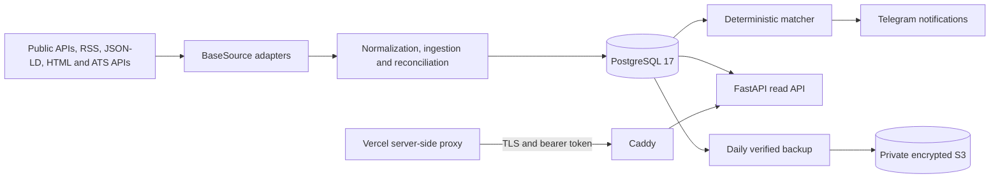

# JobRadar Backend

Production backend for JobRadar, a self-hosted job intelligence platform that collects remote
employment and freelance opportunities, normalizes heterogeneous source data, reconciles and
deduplicates listings, applies deterministic matching rules, and exposes ranked results to a web
client and Telegram.

It is a modular monolith: the FastAPI API, scheduled worker, Telegram bot, and maintenance
commands share one Python package and one PostgreSQL database while running as separate
processes. The project does not use a language model, browser automation, or unapproved private
APIs.

| Resource | Link |
| --- | --- |
| Live application | [Open JobRadar](https://jobradar-frontend-pink.vercel.app) |
| Service status | [View live uptime](https://stats.uptimerobot.com/pbYg91DSyR) |
| Frontend repository | [Bigda7/jobradar-frontend](https://github.com/Bigda7/jobradar-frontend) |

## Portfolio Highlights

- Integrates 18 employment, freelance, RSS, structured-data, and public ATS sources behind a common adapter contract.
- Uses idempotent ingestion, content hashes, canonical records, conservative inventory reconciliation, and cross-source deduplication.
- Produces explainable match scores with persisted reasons, concerns, rule versions, and content-aware notification idempotency.
- Runs FastAPI, PostgreSQL 17, the worker, and Telegram bot as hardened Docker Compose services on an ARM64 AWS EC2 instance.
- Terminates TLS at Caddy, keeps PostgreSQL private, protects data endpoints with bearer authentication, and exposes only health probes publicly.
- Creates validated daily PostgreSQL dumps, uploads them to a private encrypted S3 bucket through an EC2 IAM role, and applies independent local and off-site retention.
- Verifies formatting, linting, typing, security checks, migrations, tests, container builds, dependency vulnerabilities, and Git history in CI.

## Architecture



The production deployment places Caddy in front of the FastAPI container. PostgreSQL is not
published to the host network. A PostgreSQL advisory lock prevents a scheduled worker and a
manual one-shot worker from mutating the database concurrently.

## Technology stack

- Python 3.13
- FastAPI and Uvicorn
- SQLAlchemy 2 asynchronous ORM with psycopg 3
- PostgreSQL 17
- Alembic migrations
- HTTPX source clients
- Pydantic Settings
- structlog JSON logging with secret redaction
- Docker Compose
- pytest, Ruff, and mypy

## Supported sources

All adapters implement `BaseSource` and remain independent of API and notification code.

| Source | Transport | Data type |
| --- | --- | --- |
| Djinni | public JSON-LD | employment |
| Freelancer.com | official API | freelance |
| Work.ua | public pages through a read-only text reader | employment |
| Jobs.cz | public HTML and JSON-LD | employment |
| StartupJobs.cz | public JSON endpoints | employment |
| Prace.cz | public HTML and JSON-LD | employment |
| Freelance.cz | public JSON endpoints | freelance |
| Startup.jobs | official API | employment |
| Jobicy | public API | employment |
| We Work Remotely | RSS | employment |
| DOU Jobs | RSS | employment |
| Himalayas | public API | employment |
| The Muse | official API | employment |
| Greenhouse | public job board API | employment |
| Lever | public postings API | employment |
| Ashby | public job board API | employment |
| Arbeitnow | public API | employment |
| Remotive | public API | employment |

Upwork is intentionally unsupported because custom job-search RSS feeds were discontinued. The
project does not replace them with scraping or browser automation.

## Security model

- Runtime secrets are loaded from `.env`, which is excluded from Git and Docker build contexts.
- `.env.example` contains placeholders only.
- PostgreSQL credentials are mandatory in Docker Compose.
- API pagination and numeric filters have explicit upper and lower bounds.
- SQL statements use SQLAlchemy expressions or parameterized static SQL.
- CORS and trusted hosts are exact allowlists; wildcards are rejected.
- Data endpoints use bearer authentication when `API_BEARER_TOKEN` is configured; production
  startup rejects missing or short tokens.
- API responses include defensive browser headers. HSTS is enabled when `APP_ENV=production`.
- OpenAPI and interactive documentation endpoints are disabled in production.
- Database connections have connect, pool, statement, and readiness timeouts.
- Source failures are isolated, recorded, and redacted before logging or database storage.
- Containers run as an unprivileged user with a read-only filesystem, no Linux capabilities, and
  `no-new-privileges`.

The current HTTP API is read-only. Keep it behind a TLS reverse proxy and use a server-side proxy
for browser clients so the bearer token never enters client-side JavaScript. CORS is a browser
policy and is not authentication.

## Prerequisites

- Docker Desktop or Docker Engine with Compose v2
- Git
- Python 3.13 and `uv` for development outside Docker

## Configuration

Create a private local environment file:

```powershell
Copy-Item .env.example .env
```

Set a unique PostgreSQL password and only enable sources whose credentials are configured. For a
production API, configure exact host and browser-origin allowlists:

```dotenv
APP_ENV=production
POSTGRES_PASSWORD=your_secure_password
API_BEARER_TOKEN=replace_with_at_least_32_random_characters
API_ALLOWED_HOSTS=api.yourdomain.com
CORS_ALLOWED_ORIGINS=https://app.yourdomain.com
```

`DATABASE_URL` must contain the same PostgreSQL password. Generate the API token with a
cryptographically secure password manager or, locally, with
`python -c "import secrets; print(secrets.token_urlsafe(48))"`. Store it only in the backend secret
store and the frontend hosting provider's server-side environment variables.

Do not commit `.env`, database dumps, private keys, certificates, or handoff documents.

## Run with Docker Compose

Build and start PostgreSQL, the API, worker, and Telegram bot:

```powershell
.\scripts\compose.ps1 up --build -d
.\scripts\compose.ps1 ps
```

The PowerShell wrapper reads `POSTGRES_PASSWORD` from `.env`, or derives it in process memory from
`DATABASE_URL` for an existing local setup. It never prints or persists the derived password.
Production deployments should still provide `POSTGRES_PASSWORD` explicitly through their secret
store. On Linux, export `POSTGRES_PASSWORD` before using `docker compose` directly.

The API binds to `127.0.0.1:8000` by default:

```text
http://localhost:8000/docs
```

Inspect service logs:

```powershell
.\scripts\compose.ps1 logs --tail=100 api worker bot
```

Stop the stack without deleting PostgreSQL data:

```powershell
.\scripts\compose.ps1 down
```

## Database migrations

The API container applies committed migrations before Uvicorn starts. Apply them manually with:

```powershell
.\scripts\compose.ps1 run --rm api alembic upgrade head
```

Create and review a migration after changing ORM models:

```powershell
uv run alembic revision --autogenerate -m "describe the schema change"
uv run alembic upgrade head
```

Never use `Base.metadata.create_all()` as a production migration mechanism.

## Worker and maintenance commands

Run one forced source cycle:

```powershell
.\scripts\compose.ps1 run --rm worker python -m jobradar.worker --once
```

Run maintenance operations:

```powershell
.\scripts\compose.ps1 run --rm worker python -m jobradar.maintenance rescore-all
.\scripts\compose.ps1 run --rm worker python -m jobradar.maintenance expire-stale
.\scripts\compose.ps1 run --rm worker python -m jobradar.maintenance deduplicate-opportunities
.\scripts\compose.ps1 run --rm worker python -m jobradar.maintenance reset-hidden
```

Employment listings expire after 30 days and freelance listings after 7 days unless the
opportunity is a favorite. Successful complete snapshots reconcile removed source records. Empty
or unexpectedly reduced snapshots do not deactivate the existing inventory.

## Database backups

`scripts/backup_postgres.sh` creates a compressed PostgreSQL dump, validates it with
`pg_restore --list`, and retains local backups for 14 days by default. The systemd timer in
`deploy/systemd/` runs the script daily at `03:15 UTC`.

For off-site S3 backups, install AWS CLI v2, attach a least-privilege IAM role to the instance, and
create `/etc/jobradar/backup.env`:

```dotenv
JOBRADAR_BACKUP_S3_BUCKET=your-private-backup-bucket
JOBRADAR_BACKUP_S3_PREFIX=postgres
```

When the bucket is configured, the script uploads each validated dump and verifies its remote
size before applying local retention. Keep S3 Block Public Access enabled and configure bucket
retention independently with an S3 lifecycle rule.

## HTTP API

| Method | Path | Purpose |
| --- | --- | --- |
| `GET` | `/health` | process liveness |
| `GET` | `/ready` | PostgreSQL readiness |
| `GET` | `/jobs` | active opportunities with filters, pagination, and canonical links |
| `GET` | `/matches` | active deterministic matches with scores and canonical links |
| `GET` | `/sources` | source health and collection timestamps |

`GET /jobs` supports `q`, `work_mode`, `employment_type`, `min_salary`, `limit`, and `offset`.
`GET /matches` supports `min_score`, `limit`, and `offset`. OpenAPI documentation is available at
`/docs` and `/openapi.json` outside production. `/health` and `/ready` are public for platform
health checks; the three data endpoints require `Authorization: Bearer <token>` when a token is
configured.

## Safe production rollout

1. Back up PostgreSQL and verify that the dump can be read before applying migrations.
2. Set `APP_ENV=production`, unique database credentials, a random API bearer token, and exact
   public host allowlists in the deployment secret store.
3. Terminate TLS at a maintained reverse proxy and expose only that proxy to the internet.
4. Deploy an immutable image tag or digest, run `alembic upgrade head`, then verify `/health`,
   `/ready`, authenticated `/jobs`, and authenticated `/matches`.
5. Protect `main`, require the CI workflow, and review Dependabot pull requests before merging.

Never copy `.env` into an image, repository, workflow, issue, or build log. Rotate a credential
immediately if it may have been exposed.

## Telegram bot

When Telegram polling is enabled, the bot supports `/latest`, `/all`, `/favorites`, `/stats`,
`/clear`, `/pause`, and `/resume`. Inline actions support favorite, hide, restore, and source-link
operations. User state and sent message identifiers are persisted in PostgreSQL.

Validate configured Telegram credentials with one test message:

```powershell
.\scripts\compose.ps1 run --rm worker python -m jobradar.worker --test-telegram
```

## Development and quality checks

Install the locked development environment:

```powershell
uv sync --extra dev
```

Run unit tests and static checks:

```powershell
uv run pytest -m "not integration"
uv run ruff format --check .
uv run ruff check .
uv run mypy src
```

Run PostgreSQL integration tests in containers:

```powershell
.\scripts\compose.ps1 --profile test run --rm test
```

## Project layout

```text
alembic/                 database migrations
deploy/systemd/          backup timer examples
scripts/                 operational scripts
src/jobradar/api/        FastAPI application and schemas
src/jobradar/db/         SQLAlchemy models, sessions, and advisory locks
src/jobradar/ingestion/  normalization, idempotency, and deduplication
src/jobradar/matching/   deterministic profile scoring
src/jobradar/notifications/ Telegram delivery and currency conversion
src/jobradar/sources/    isolated BaseSource adapters
tests/                   unit and PostgreSQL integration tests
```

## Adding a source

1. Implement `BaseSource.fetch()` and `BaseSource.normalize()` in `src/jobradar/sources`.
2. Enforce remote-only evidence before ingestion.
3. Set complete-snapshot reconciliation behavior explicitly.
4. Add bounded timeouts, pagination, rate-limit behavior, and a conservative poll interval.
5. Register the adapter in `sources/registry.py` and add validated settings.
6. Add deterministic fixture-based tests for valid, malformed, partial, and rate-limited data.

Keep source-specific network and mapping logic out of the API, matching, and notification layers.
